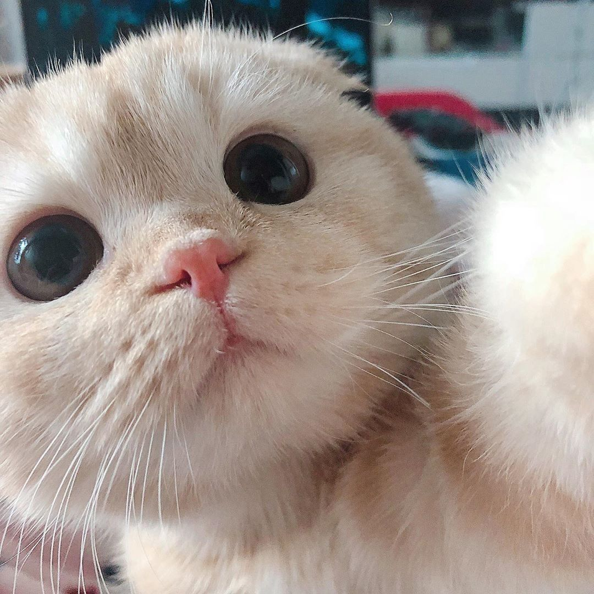

# Atividade Em Dupla 
Uma breve descrição sobre o que esse projeto faz e para quem ele é

## 🚀 Proposta

Recebemos a atividade com a ideia de praticarmos e aplicar os comandos simples do Git & Github entendendo melhor sobre como funciona toda a parte de trabalho em conjunto com outros programadores.


### 📋 Pré-requisitos

* A força de vontade
* Git instalado

```
https://git-scm.com/downloads
```

### 🔧 Aplicação

Utilizamos a IDE [Visual Studio Code](https://code.visualstudio.com/) por ser simples, interativa e de facil acesso, aplicamos um codigo simples de html para iniciarmos o projeto

```
<!DOCTYPE html>
<html lang="pt-br">
    <head>
        <title>Título da página</title>
        <meta charset="utf-8">
    </head>
    <body>
        <h1>Aqui vai um título</h1>
    </body>
</html>
```

Em seguida Alteramos o codigo com fotos de gatos como o pedido pelo professor.

```
<html lang="pt-br">
<head>
    <meta charset="UTF-8">
    <title>Título da Página</title>
    <title>Fanpage de Gatinhos</title>
</head>
<body>
    <h1>Aqui vai um Título</h1>
    <h1>Perfil #catsoninstagram</h1>
    
</body>
</html>
```

E após as alterações, passamos esses arquivos para o github usando o git para que o próximo colaborador pudesse modificá-la, onde ele criou uma branch chamada "A.Prates" para que as modificações fossem feitas.

```
<!DOCTYPE html>
<html lang="pt-br">

<head>
    <meta charset="UTF-8">
    <title>Fanpage de Gatinhos</title>
    <style>
        .cor1{
        color: blueviolet;
        }
    </style>
</head>

<body>
    <h1>Perfil #catsoninstagram</h1>
    <h1 class="cor1">Perfil #catsoninstagram</h1>
    
    
</body>

</html>
```
Em seguida Apenas finalizamos fazendo um Pull request & Merge
## 🛠️ Construído com

Mencione as ferramentas que você usou para criar seu projeto

* **IDE** -[Visual Studio Code](https://code.visualstudio.com/)
* **Repositório** - [Github](https://github.com/)
* **Controle de Versão** - [Git](https://git-scm.com/downloads)
## ✒️ Autores


* **Desenvolvedor** - *Trabalho Parte 1* - [Luiz Felipe](https://github.com/luizzez)
* **Desenvolvedor** - *Trabalho Parte Final* - [Arthur Prates](https://github.com/Arthur-Prates)
